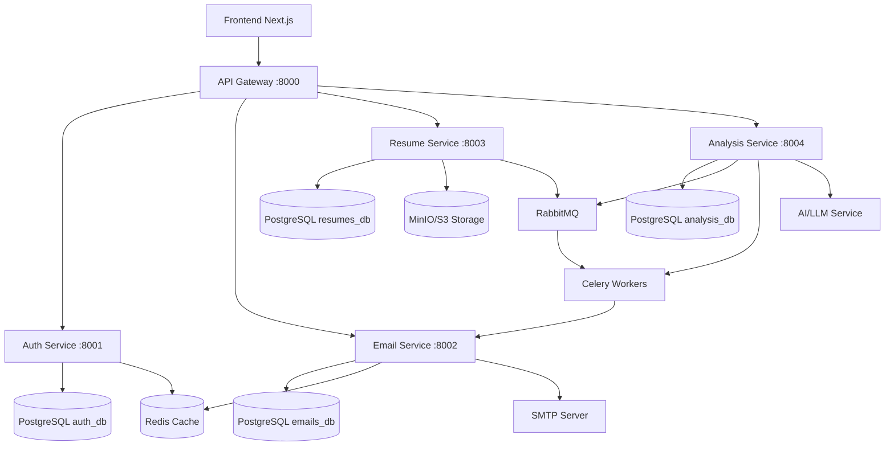

# 🏗️ Системный дизайн микросервисной архитектуры

## 🎯 Обзор системы

Система анализа резюме и определения зарплатных ожиданий, построенная на микросервисной архитектуре с использованием FastAPI.

## 📊 Микросервисы

### 1. 🚪 API Gateway (FastAPI + Nginx)
**Порт:** 8000  
**Роль:** Единая точка входа, маршрутизация, аутентификация, rate limiting  

**Функции:**
- Проксирование запросов к микросервисам
- JWT токен валидация
- Rate limiting (6 req/min для поллинга)
- CORS и безопасность
- Логирование запросов

**Роуты:**
```
/api/v1/auth/*        → Auth Service
/api/v1/emails/*      → Email Service  
/api/v1/resumes/*     → Resume Service
/api/v1/analysis/*    → Analysis Service
```

### 2. 🔐 Auth Service (FastAPI)
**Порт:** 8001  
**БД:** PostgreSQL (auth_db)  

**Функции:**
- OAuth2 аутентификация (Google, GitHub)
- JWT токен генерация/валидация
- Refresh токены
- Управление пользователями

**API:**
```
POST /oauth/google     - Google OAuth
POST /oauth/github     - GitHub OAuth  
POST /refresh          - Обновление токена
GET  /me              - Профиль пользователя
```

### 3. 📧 Email Service (FastAPI)
**Порт:** 8002  
**БД:** PostgreSQL (emails_db)  
**Кэш:** Redis  

**Функции:**
- Подписка на email уведомления
- Дедупликация email адресов
- Отправка результатов анализа
- SMTP интеграция

**API:**
```
POST /subscribe              - Подписка
GET  /status/{email}         - Статус подписки
POST /send-results           - Отправка результатов (internal)
```

### 4. 📄 Resume Service (FastAPI)
**Порт:** 8003  
**БД:** PostgreSQL (resumes_db)  
**Storage:** S3 (сначала лучше сделать сохранение в файлах)

**Функции:**
- Загрузка файлов резюме
- Валидация форматов (PDF, DOC, DOCX, TXT)
- Хранение метаданных
- Парсинг текста

**API:**
```
POST /upload                 - Загрузка резюме
GET  /supported-formats      - Поддерживаемые форматы
GET  /{id}/content          - Содержимое резюме (internal)
```

### 5. 🔍 Analysis Service (FastAPI)
**Порт:** 8004  
**БД:** PostgreSQL (analysis_db)  
**Queue:** Redis
**Worker:** Celery  

**Функции:**
- Анализ резюме с помощью LLM
- Определение зарплатных ожиданий
- Сравнение с рыночными данными
- Генерация рекомендаций

**API:**
```
POST /start                  - Запуск анализа (internal)
GET  /{id}                  - Статус и результаты анализа
POST /webhook               - Обработка результатов (internal)
```

## 🗄️ Инфраструктурные компоненты

### База данных
```
PostgreSQL (Docker)
├── auth_db      - Пользователи, токены
├── emails_db    - Email подписки  
├── resumes_db   - Метаданные файлов
└── analysis_db  - Результаты анализа
```

### Кэширование
```
Redis (Docker)
├── JWT blacklist
├── Rate limiting counters
├── Email статусы
└── Временные данные
```

### Файловое хранилище
```
MinIO/S3
└── resumes/
    ├── original/     - Оригинальные файлы
    └── processed/    - Обработанные тексты
```

### Очереди задач
```
RabbitMQ + Celery
├── analysis.start    - Запуск анализа
├── email.send       - Отправка email
└── cleanup.files    - Очистка старых файлов
```

## 🔄 Схема взаимодействия



## 🚀 Пользовательский сценарий

1. **Загрузка страницы** → Frontend загружается
2. **Email подписка** → Gateway → Email Service → PostgreSQL
3. **Загрузка резюме** → Gateway → Resume Service → S3 + PostgreSQL
4. **Автоматический запуск анализа** → Resume Service → RabbitMQ → Analysis Service
5. **Поллинг статуса** → Frontend → Gateway → Analysis Service (каждые 10сек)
6. **Завершение анализа** → Celery Worker → Analysis Service → Email Service
7. **Отправка результатов** → Email Service → SMTP → Пользователь

## ⚙️ Технический стек

- **Backend:** FastAPI + Python 3.11
- **Databases:** PostgreSQL 15
- **Cache:** Redis 7
- **Queue:** RabbitMQ + Celery
- **Storage:** MinIO (S3-compatible)
- **Gateway:** Nginx + FastAPI
- **Deployment:** Docker + Docker Compose
- **Monitoring:** Prometheus + Grafana

## 🔒 Безопасность

- JWT токены с коротким TTL (15 мин)
- Refresh токены (7 дней)
- Rate limiting на Gateway
- CORS настройки
- Валидация файлов
- Encrypted storage для персональных данных

## 📈 Масштабирование

- Горизонтальное масштабирование каждого сервиса
- Load balancer на Gateway уровне  
- Кэширование часто запрашиваемых данных
- Асинхронная обработка через очереди
- CDN для статических файлов (резюме)

---
*Архитектура рассчитана на нагрузку до 1000 одновременных пользователей с возможностью масштабирования.*